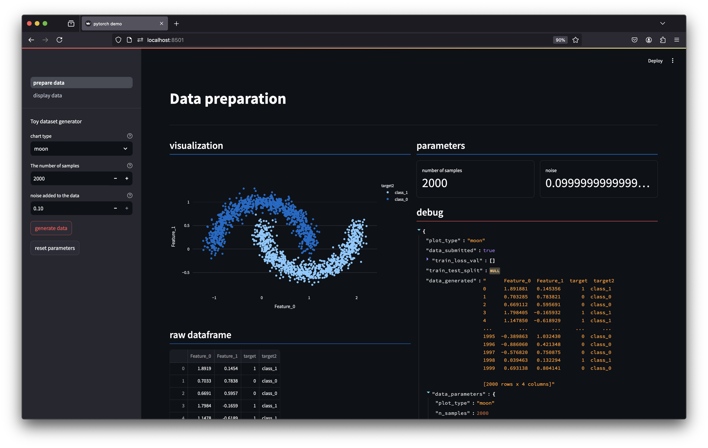
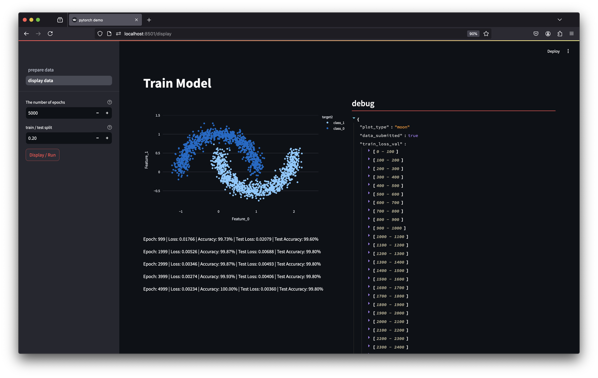

# PYTORCH_DEMO
- goal: train and test deeplearning model architecture on toys dataset using `streamlit` and `pytorch`
- Inspiration comes from the `tensorflow` UI: https://playground.tensorflow.org
- I limit the toys datasets to `sklearn` datasets (https://scikit-learn.org/stable/api/sklearn.datasets.html):
    - blobs: `make_classification`
    - circles: `make_circles`
    - moons: `make_moons`

# Status
- work in progress
- `main.py`: using streamlit `st.navigation` to switch between pages
- `templates/settings.py`: select dataset and its parameters
- `templates/display.py`: 
    - select the model parameters and display the results [_DL hidden layers hard coded for now_]
    - display predictions and decision boundaries [_work in progress_]
    - display `loss` and `accuracy` vs. `epoch` [_work in progress_] 

# Screenshots

